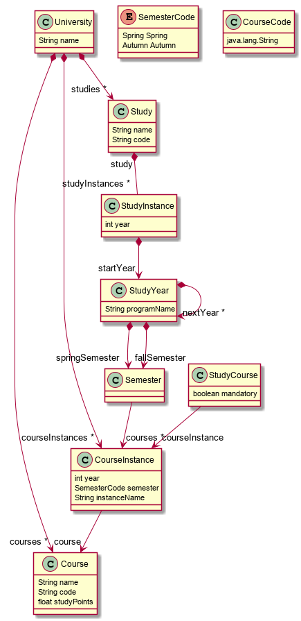

# Exercise 1 - NTNU studies

This ECore model will model NTNU studies for 
[MTDT](https://www.ntnu.no/studier/mtdt/oppbygning#year=2016&programmeCode=MTDT),
[MIDT](https://www.ntnu.no/studier/midt/oppbygning#year=2018&programmeCode=MIDT&dir=MIDTPRU-18),
[MSIT](https://www.ntnu.no/studier/msit/oppbygning#year=2019&programmeCode=MSIT&dir=MSIT-SWE-19).

Open the project in _'Eclipse for DSL Developers'_ with some extra EMF plugins.

The documentation/tutorial for Object Constraint Language (OCL) are found at https://help.eclipse.org/2019-06/index.jsp  
For the OclInEcore plugin: https://wiki.eclipse.org/OCL/OCLinEcore#Registration  
Some helpful stuff at [https://wiki.eclipse.org/EMF/FAQ#I_want_to_use_EMF.2C_SDO.2C_or_XSD_in_my_standalone_project.2C_or_include_only_a_working_subset_of_the_code._What_libraries_.28jar_files.29_do_I_need_in_my_CLASSPATH.3F](eclipse wiki).  

